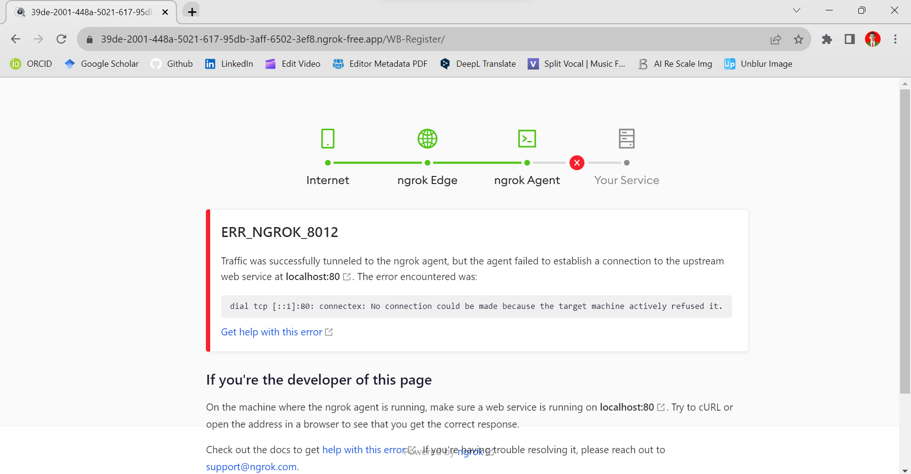
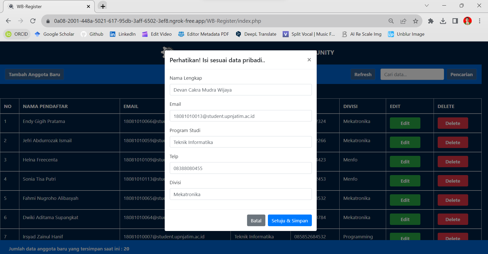
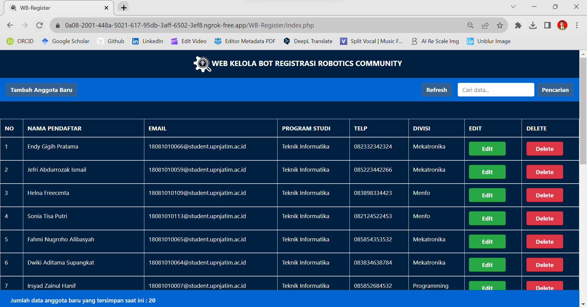
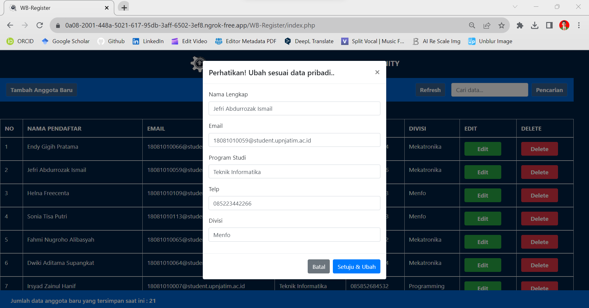
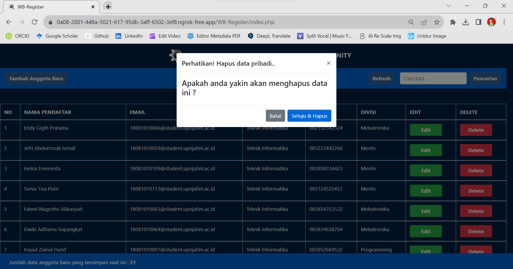
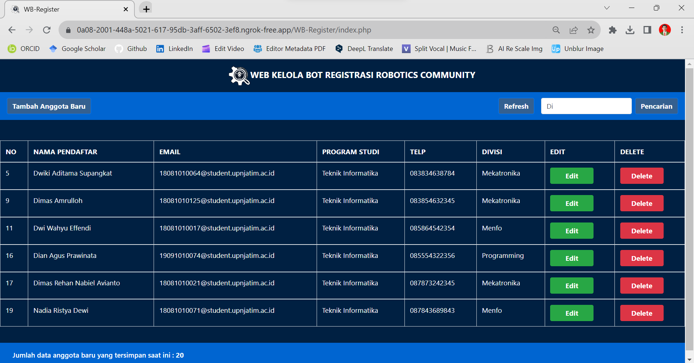

[](https://github.com/ellerbrock/open-source-badges/)
[](https://opensource.org/licenses/MIT)


# WB-Register
<strong>Tugas Akhir Pemrograman Web</strong><br>
Membuat aplikasi multi platform: Website-Bot Register untuk pendaftaran anggota baru komunitas Robotika UPN Veteran Jatim.

<br><br>

## Kebutuhan Proyek
| Bagian | Deskripsi |
| --- | --- |
| Fitur | Buat, Baca, Perbarui, Hapus, Pencarian, Hitung Data, Validasi, Segarkan Halaman, Pengendalian Masalah |
| Kode | PHP, HTML, CSS, JS, SQL |
| Kerangka Kerja | Bootstrap 4, Botman |
| Peralatan | XAMPP (PHP Versi 7.4), Composer, Git, Ngrok |

<br><br>

## Unduh & Instal
1. XAMPP dengan PHP versi 7.4

   <table><tr><td width="810">
      
   ```
   https://bit.ly/XAMPP_PHP7_Installer
   ```

   </td></tr></table><br>

2. Ngrok

   <table><tr><td width="810">
      
   ```
   https://bit.ly/NGROK_Installer
   ```

   </td></tr></table><br>

3. Composer

   <table><tr><td width="810">
      
   ```
   https://bit.ly/Composer_Installer
   ```

   </td></tr></table><br>

4. Git

   <table><tr><td width="810">
      
   ```
   https://bit.ly/GIT_Installer
   ```

   </td></tr></table>
    
<br><br>

## Basis data
1. Buka ``` XAMPP ```, lalu tekan tombol mulai di bagian ``` Apache ``` & ``` MySQL ```. Hal ini bertujuan untuk dapat mendukung website secara optimal.<br><br>

2. Akses peramban terlebih dahulu untuk membuka panel admin basis data, silakan salin tautan berikut: ``` localhost/phpmyadmin/ ```.<br><br>
   
4. Buat basis data bernama ``` wb_register ``` di lokal.<br><br>

5. Buka basis data ``` wb_register ``` dan Impor ``` WB_Register_db.sql ``` di direktori ``` WB-Register/assets/sql ```.

<br><br>

## Memulai
1. Unduh repositori ini lalu ekstrak.<br><br>

2. Pindahkan direktori ``` WB-Register ``` ke dalam direktori ``` htdocs ```, yang rinciannya dapat anda lihat sebagai berikut: ``` C:\xampp\htdocs ```.<br><br>
   
3. Buat akun Ngrok terlebih dahulu di halaman berikut: <strong>https://dashboard.ngrok.com/login</strong>.<br><br>

4. Hubungkan akun ngrok dengan cara berikut:

   <table><tr><td width="810">

   ```bash
   ngrok config add-authtoken [YOUR NGROK AUTHTOKEN]
   ```

   </td></tr></table><br>

5. Buka berkas ``` ngrok.yml ``` di dalam direktori ``` C:\Users\[User Name]\AppData\Local\ngrok ``` , kemudian atur tunnel agar dapat digunakan untuk banyak port sekaligus dengan menuliskan perintah berikut di dalamnya:

   <table><tr><td width="810">

   ```bash
   version: "2"
   authtoken: [YOUR NGROK AUTHTOKEN]
   tunnels:
     tunnel-1:
       proto: http
       addr: 80
       schemes: ["https"]
     tunnel-2:
       proto: http
       addr: 80
       schemes: ["http", "https"]
   ```

   </td></tr></table><br>
   
6. Ketik perintah berikut ke dalam ``` NGROK.exe ``` dan tekan enter:

   <table><tr><td width="810">

   ```bash
   ngrok start --all
   ```

   </td></tr></table><br>

7. Salin ``` URL https ``` di ``` NGROK ```, dan tempelkan URL tersebut ke dalam folder (direktori) berikut: ``` WB-Register -> url_ngrok -> generate_url (Catatan: url hanya berlaku untuk dijalankan sesekali) ```.<br><br>

8. Salin ``` API Bot Telegram ``` anda dari ``` @BotFather ``` dan tempelkan ke dalam folder (direktori) berikut: ``` WB-Register -> multiplatform -> tgbot -> private -> token.txt ```.<br><br>

9. Buka ``` browser ``` anda, lalu ketikkan perintah dengan aturan berikut untuk menjalankan web: ``` [URL Https NGROK]/WB-Register/ ```.
    
    • Contoh penulisan:

    <table><tr><td width="810">
   
    ```bash
    https://e6e5-2001-448a-5021-617-ecb0-7d4d-1d9e-27f2.ngrok-free.app/WB-Register/
    ```
    
    </td></tr></table><br>
    
10. Klik -> ``` Visit Site ```.<br><br>
       
11. Buka ``` CMD (Command Prompt) ``` dan ketikkan perintah dengan aturan berikut untuk menjalankan bot: ``` curl -d url=[URL Https NGROK]/[Folder Jika Ada]/bot.php -X POST https://api.telegram.org/bot[TOKEN]/setWebhook ```.<br><br>

    • Contoh penulisan:

    <table><tr><td width="810">
      
    ```bash
    curl -d url=https://e6e5-2001-448a-5021-617-ecb0-7d4d-1d9e-27f2.ngrok-free.app/Cryptodax-Bot/bot.php -X POST https://api.telegram.org/bot1496456979:AAE7MCBAeRznBN3G-E4J65GgVYzHo0oZmog/setWebhook 
    ```
    
    </td></tr></table><br>

    • Hasilnya akan muncul (tanda Bot sudah bekerja / aktif): ``` {"ok":true,"result":true,"description":"Webhook was set"} ```.<br><br>
         
12. Jika anda ingin menyelesaikan ``` sesi webhook ``` yang sedang berjalan, maka buka ``` browser ``` dengan mengetikkan perintah berikut:<br>

    <table><tr><td width="810">

    ```bash
    https://api.telegram.org/bot[TOKEN]/setWebhook
    ```

    </td></tr></table>

<br><br>

## Permasalahan yang sering muncul
1. Lupa menjalankan ``` apache ``` dan ``` sql ``` yang ada pada ``` XAMPP ``` atau bisa jadi ada permasalahan di ``` pengaturan Ngrok ``` anda. Contoh permasalahannya dapat anda lihat seperti gambar berikut ini:<br><br>
<br><br>

2. Masalah yang biasanya terjadi pada bot telegram berbasis Botman adalah saat pengguna telah meninggalkan bot tersebut dalam rentang waktu yang lama, hal ini dapat mengakibatkan ``` API Token menjadi kadaluarsa ```. Masalah ini biasanya ditandai dengan keadaan ``` bot telegram yang tidak normal ```, misalnya ketika pengguna memberikan perintah ``` /start ``` ataupun perintah lainnya, bot ini tetap tidak merespon. Solusi dari permasalahan ini yaitu anda ``` hanya perlu membuat bot telegram yang baru lagi ``` (otomatis dapat API Token yang baru), selanjutnya untuk kode program silakan atur berdasarkan kebutuhan anda masing-masing.<br><br>

3. Jika masalah pada poin 1 tidak teratasi, maka anda harus :
   
   • Menghapus 3 file yang ada di dalam direktori ``` C:\xampp\htdocs\WB-Register\multiplatform\tgbot ``` yaitu ``` composer.json ```, ``` composer.lock ```, dan ``` vendor ```.

   • Instal depedensi ``` Botman ``` melalui ``` GitBash ``` dengan memberikan perintah seperti berikut:

   <table><tr><td width="810">

   ```bash
   composer require "botman/driver-telegram"
   ```

   </td></tr></table>

<br><br>

## Kelompok Pemrograman Website
| NOMOR | NAMA LENGKAP | NPM |
| --- | --- | --- |
| 1 | Devan Cakra Mudra Wijaya | 18081010013 |
| 2 | Tasya Ardhian Nisaa' | 18081010049 |
| 3 | Susy Rahmawati | 18081010048 |

<br><br>

## Sorotan
<table>
<tr>
<th width="280">Buat</th>
<th width="280">Baca</th>
<th width="280">Perbarui</th>
</tr>
<tr>
<td></td>
<td></td>
<td></td>
</tr>
</table>
<table>
<tr>
<th width="420">Hapus</th>
<th width="420">Pencarian</th>
</tr>
<tr>
<td></td>
<td></td>
</tr>
</table>
<table>
<tr>
<th colspan="6">Bot Telegram</th>
</tr>
<tr>
<td width="140"></td>
<td width="140"></td>
<td width="140"></td>
<td width="140"></td>
<td width="140"></td>
<td width="140"></td>
</tr>
</table>

<br><br>

## Demonstrasi Aplikasi
Via Telegram: <a href="http://t.me/roboticsupnjt_bot">@roboticsupnjt_bot</a>

<br><br>

## Apresiasi
Jika karya ini bermanfaat bagi anda, maka dukunglah karya ini sebagai bentuk apresiasi kepada penulis dengan mengklik tombol ``` ⭐Bintang ``` di bagian atas repositori.

<br><br>

## Penafian
Aplikasi ini merupakan hasil karya saya bersama tim saya dan bukan merupakan hasil plagiat dari penelitian atau karya orang lain, kecuali yang berkaitan dengan layanan pihak ketiga yang meliputi: pustaka, kerangka kerja, dan lain sebagainya.

<br><br>

## LISENSI 
LISENSI MIT - Hak Cipta © 2021 - Devan C. M. Wijaya dkk

Dengan ini diberikan izin tanpa biaya kepada siapa pun yang mendapatkan salinan perangkat lunak ini dan file dokumentasi terkait perangkat lunak untuk menggunakannya tanpa batasan, termasuk namun tidak terbatas pada hak untuk menggunakan, menyalin, memodifikasi, menggabungkan, mempublikasikan, mendistribusikan, mensublisensikan, dan/atau menjual salinan Perangkat Lunak ini, dan mengizinkan orang yang menerima Perangkat Lunak ini untuk dilengkapi dengan persyaratan berikut:

Pemberitahuan hak cipta di atas dan pemberitahuan izin ini harus menyertai semua salinan atau bagian penting dari Perangkat Lunak.

DALAM HAL APAPUN, PENULIS ATAU PEMEGANG HAK CIPTA DI SINI TETAP MEMILIKI HAK KEPEMILIKAN PENUH. PERANGKAT LUNAK INI DISEDIAKAN SEBAGAIMANA ADANYA, TANPA JAMINAN APAPUN, BAIK TERSURAT MAUPUN TERSIRAT, OLEH KARENA ITU JIKA TERJADI KERUSAKAN, KEHILANGAN, ATAU LAINNYA YANG TIMBUL DARI PENGGUNAAN ATAU URUSAN LAIN DALAM PERANGKAT LUNAK INI, PENULIS ATAU PEMEGANG HAK CIPTA TIDAK BERTANGGUNG JAWAB, KARENA PENGGUNAAN PERANGKAT LUNAK INI TIDAK DIPAKSAKAN SAMA SEKALI, SEHINGGA RISIKO ADALAH MILIK ANDA SENDIRI.
